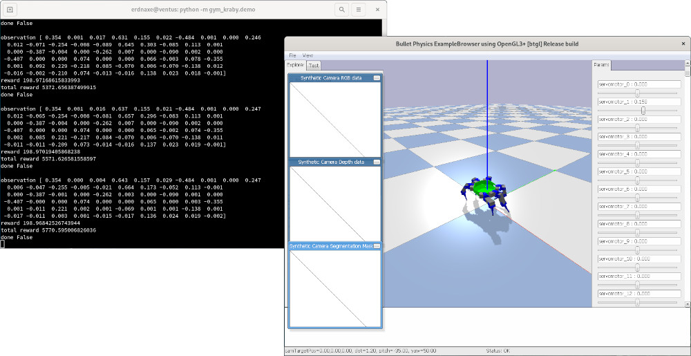

# Introduction to reinforcement learning

**Reinforcement learning** (RL) consists in using machine learning techniques to
make decisions and control robots.
The domain studies how **an agent** can learn how to achieve goals in **an environment**.

At every step of the environment (each 50ms for our robot),
the agent sees **an observation** of this environment and send **an action** to take depending on **his policy**.

When learning, the environment also returns **a reward** at every step to indicate how bad the agent did act.
The sum of all these rewards when the episode ends is **the return** of this episode.

# OpenAI Gym environments

The **OpenAI Gym** library defines an interface to reinforcement learning
environments, making them easier to share and use.
Gym also provides a large collection of environments to benchmark different learning algorithms[^OpenAIGym].

A Gym environment is a Python class implementing a set of methods:

```Python
import gym

class ExampleEnv(gym.Env):
    def __init__(self, param1=0.01, param2=False, param3=200):
        super().__init__()
        # Initialize the environment

    def reset(self):
        # Reset the environment
        return observation

    def step(self, action):
        # Do an action
        return observation, reward, done, {}

    def render(self, mode='human'):
        # Render the environment for human visualization or for recording

    def close(self):
        # Close environment
        
    def seed(self, seed=None):
        # Change the random number generator seed
```

## OpenAI Gym Reacher-v2

OpenAI Gym includes [an environment](https://github.com/openai/gym/blob/master/gym/envs/mujoco/reacher.py) of an robot arm in a 2D space which goal is to reach a target.
It uses [MuJoCo](http://www.mujoco.org/) which is a proprietary equivalent of BulletPhysics.

<iframe width="560" height="315" src="https://www.youtube-nocookie.com/embed/OtJ_6Nu8Ic0" frameborder="0" allow="accelerometer; autoplay; encrypted-media; gyroscope; picture-in-picture" allowfullscreen></iframe>

It is a great base to start with as one of our goals is to make one robot leg reach a target.

## Reinforcement learning tasks associated with kraby

The [gym_kraby](https://pypi.org/project/gym-kraby/) Python package includes
four OpenAI Gym environments:

-   `gym_kraby:HexapodBulletEnv-v0`: simulate full robot with BulletPhysics,

-   `gym_kraby:HexapodRealEnv-v0`: command the full real robot,

-   `gym_kraby:OneLegBulletEnv-v0`: simulate only one leg of the robot with
    BulletPhysics,

-   `gym_kraby:OneLegRealEnv-v0`: command only one leg of the robot.

You may install and test those environments by running in a Python environment:

```bash
pip install gym-kraby
python -m gym_kraby.demo --help
```

The package includes
[a demo script](https://github.com/erdnaxe/kraby/blob/master/gym_kraby/demo.py)
to test each environment.



## Using Kraby Gym environments

You may use these environments as any other OpenAI Gym environment.
You could also invoke the environment with `render=True` to show
PyBullet GUI.

```Python
import gym

env = gym.make('gym_kraby:HexapodBulletEnv-v0', render=True)
observation = env.reset()
score_return = 0

for _ in range(10000):
    a = env.action_space.sample()  # take a random action
    observation, reward, done, _ = env.step(a)  # step
    score_return += reward

env.close()
```

[^OpenAIGym]: "[Gym](http://gym.openai.com/docs/)." OpenAI documentation.
