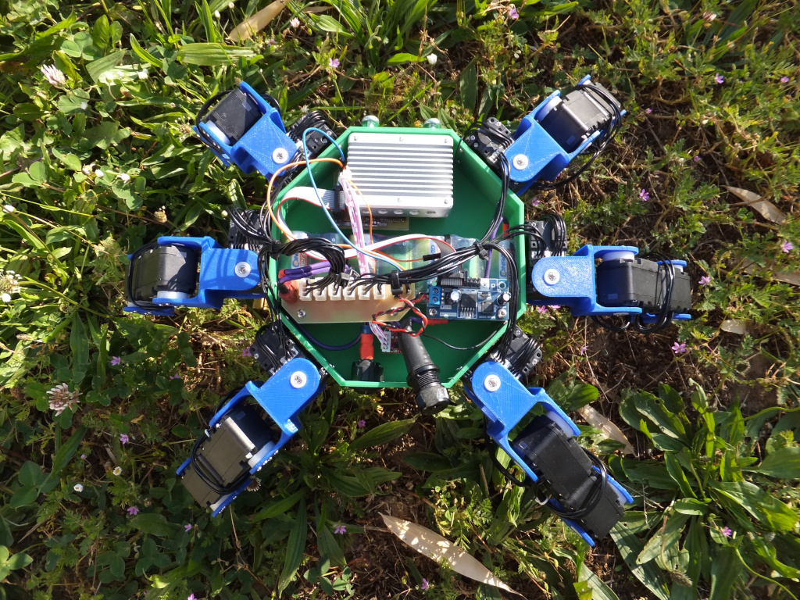
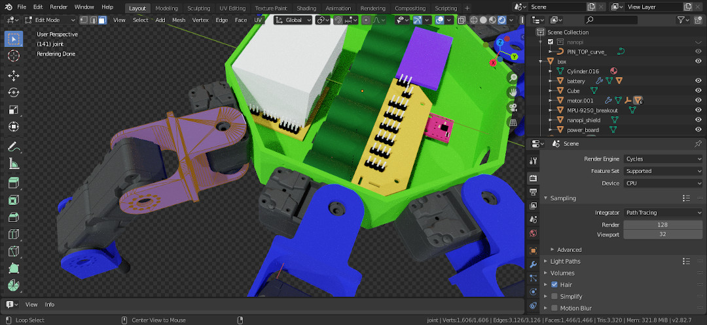

# Kraby

Open-source hexapod robot.

* * *

## Overview

Kraby is an **open-source**, **3d-printable** hexapod robot that is geared towards
building a solid development platform for research and educational purpose.

The robot was designed during a Master 1
project at [ENS Paris-Saclay](https://ens-paris-saclay.fr/), France.

### Easy to remix

The robot was designed using [Blender](https://www.blender.org/),
a free and open-source 3D computer graphics editing software.
Download and remix [Kraby Blender sources](https://github.com/erdnaxe/kraby/tree/master/3d_parts/Blender).

### Smart servo-motors

Kraby uses 18 **Herkulex DRS-0101** servomotors from Dongbu to stay cost
effective while offering reasonable performances.
These includes a DC motor, a gear reducer, a control circuitry and
serial communications capability.
These servomotors are able to measure motor torque and speed, and are easy to
use with a serial port.

These servomotors are similar to the more popular **Dynamixel AX-12**.

### Simulation environment included

An [OpenAI Gym](https://gym.openai.com/) environment is available.
It uses [BulletPhysics](https://github.com/bulletphysics/bullet3) simulator
with [an URDF description](https://github.com/erdnaxe/kraby/blob/master/gym_kraby/data/hexapod.urdf) of the robot.

* * *

## Build instructions

To build a fully featured robot you will need to
[build the structure](build_the_structure)
then [build the electronics](build_the_electronics).

* * *

## Getting help

To get help with Kraby,
please join [#kraby:auro.re](https://matrix.to/#/#kraby:auro.re) Matrix room or
use [GitHub issues](https://github.com/erdnaxe/kraby/issues).
