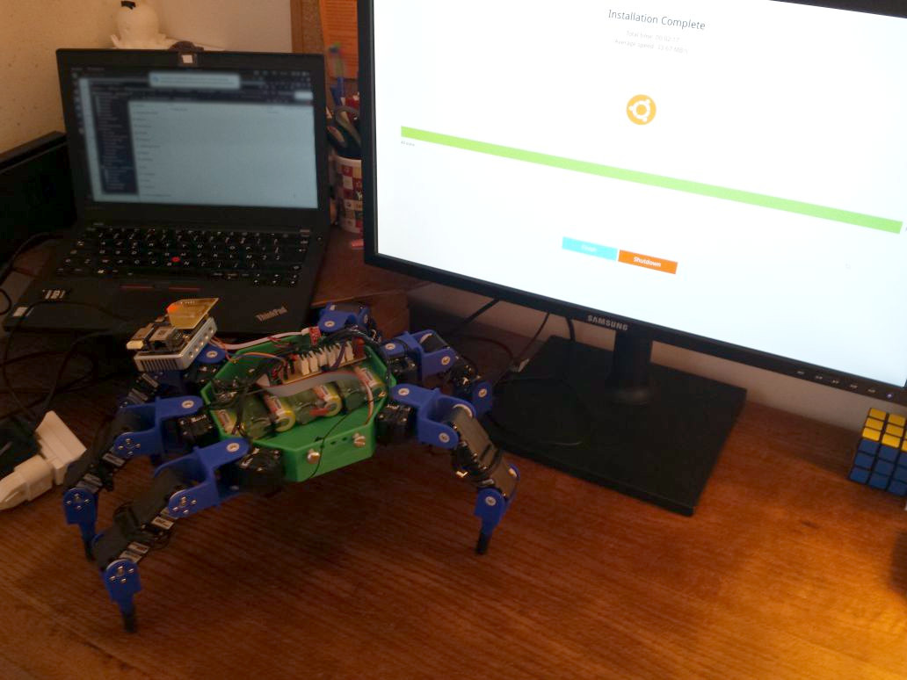
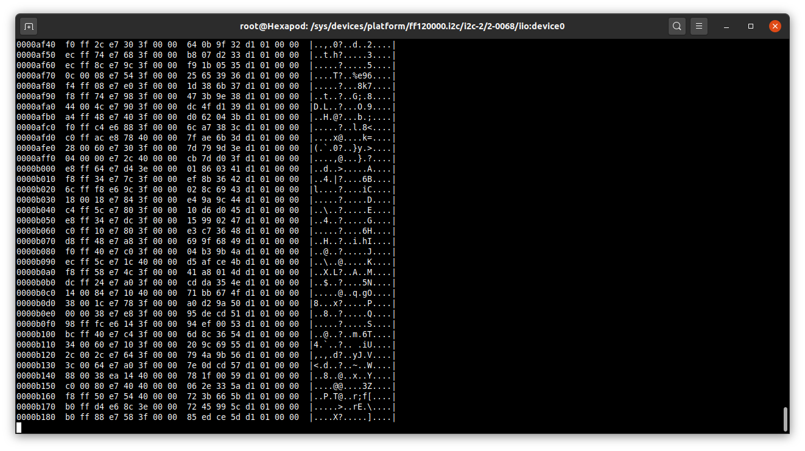
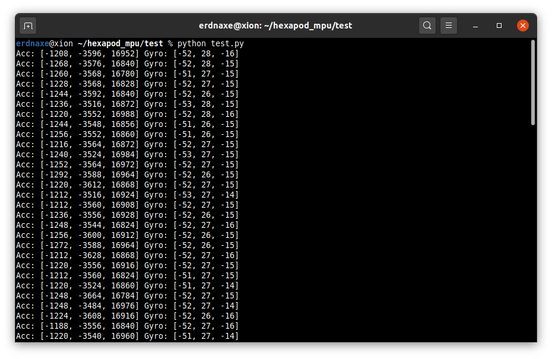

# Compile NanoPi linux kernel with MPU9250 module

As of may 2020, only the official NanoPi kernel supports NanoPi Neo4 GPU and VPU.
The downside is this kernel does not include `inv-mpu6050` that supports the MPU9250,
so we are going to compile the kernel with this module.

`inv-mpu6050` is part of Linux Industrial I/O (IIO) subsystem driver
that provides an unified framework for sensors.
Learn more about IIO on [the official Linux Kernel documentation](https://www.kernel.org/doc/html/v4.14/driver-api/iio/index.html).

Install an ARM64 toolchain and download NanoPi kernel source code,
```bash
sudo apt install build-essential gcc-aarch64-linux-gnu gcc-arm-none-eabi
git clone https://github.com/friendlyarm/kernel-rockchip --depth 1 -b nanopi4-linux-v4.4.y
cd kernel-rockchip
```

Load NanoPi Linux configuration, `make ARCH=arm64 nanopi4_linux_defconfig`.

Add MPU9250 module, `make ARCH=arm64 menuconfig` then
`Device drivers > Industrial I/O support > Inertial measurement units > <*> Invensense MPU6050 devices`.

Add the MPU9250 to the board device-tree, edit `arch/arm64/boot/dts/rockchip/rk3399-nanopi4-common.dtsi`
and change:
```C
&i2c2 {
	status = "okay";

	mpu9250@68 {
		//compatible = "invensense,mpu9250";  // requires Linux 4.12
		compatible = "invensense,mpu6050";
		reg = <0x68>;
		interrupt-parent = <&gpio1>;
		interrupts = <0 IRQ_TYPE_LEVEL_HIGH>;
		/* Commented because requires Linux 4.12
		i2c-gate {
			#address-cells = <1>;
			#size-cells = <0>;
			ax8975@c {
				compatible = "ak,ak8975";
				reg = <0x0c>;
			};
		};*/
	};
};
```

Compile with `make ARCH=arm64 nanopi4-images`.
This will generate `kernel.img` and `resource.img` files.

*Note:* you may need to change `CONFIG_CROSS_COMPILE="aarch64-linux-gnu-"` in `.config`
to point to the correct cross-compilation toolchain.

*Note:* you can directly update the running kernel without reflashing rootfs with
`sudo dd if=kernel.img of=/dev/mmcblk1p5` and `sudo dd if=resource.img of=/dev/mmcblk1p4`.
Please use with caution, you may brick your device!

# Install modified FriendlyCore

FriendlyCore uses an overlay filesystem, so removing software such as xorg after the flashing is useless.

Download FriendlyCore from <http://download.friendlyarm.com/NanoPiNEO4>.
At the time of wrtting this tutorial, it was `rk3399-eflasher-friendlycore-bionic-4.4-arm64-20200409.img`.

Dump image on a SD Card (at least 8GB), `dd if=rk3399-eflasher...img of=/dev/mmcblk0 status=progress`.

Remplace `friendlycore-arm64/kernel.img` and `friendlycore-arm64/resource.img` files on the SD card
with those generated in the previous section.



Boot and install FriendlyCore with screen and keyboard attached, then reboot without SD card.
Run `npi-config` and change user password and enable SSH access.

Disable PWM Fan service, udisk, polkit, Bluetooth and ModemManager,
`sudo systemctl disable pwm-fan udisks2 polkit bluetooth ModemManager`.
Also block Bluetooth `sudo rfkill block 0`.

Edit `/etc/rc.local` to:
```bash
#!/bin/sh -e
exit 0
```

Add Hotspot WiFi network,
```bash
sudo nmcli dev wifi hotspot ifname wlan0 ssid Hexapod password "tfpopcorns"
sudo nmcli connection modify Hotspot autoconnect yes
sudo nmcli connection up Hotspot
```

Reboot and connect to WiFi "Hexapod" with password "tfpopcorns",
then `ssh pi@10.42.0.1`.

*Note:* you can plug wired Internet access
and NetworkManager will automatically use and share this connection.

# Test the MPU9250

The iio kernel driver makes the MPU9250 available in
`/sys/bus/iio/devices/iio:device1` and `/dev/iio:device1`.

You can get the X-axis acceleration with
```bash
cat "/sys/bus/iio/devices/iio:device1/in_accel_x_raw"
```

Then you can try to stream a accelerometer axis,

```bash
echo 1 > "/sys/bus/iio/devices/iio:device1/scan_elements/in_accel_x_en"
echo 1 > "/sys/bus/iio/devices/iio:device1/buffer/enable"
hexdump -C /dev/iio\:device1
```



# Get raw data from MPU9250 in Python

Download, install and enable iiod server on NanoPi,
```bash
sudo apt install iiod
sudo systemctl enable iiod
```

Now any device on the network can interact with the inertial motion unit,
install `python3-libiio` then use the following code to get data,
```python
import iio

class IMUBuffer:
    channels = ["accel_x", "accel_y", "accel_z",
                "anglvel_x", "anglvel_y", "anglvel_z"]

    def __init__(self, ip, device_name):
        self.ip = ip
        self.device_name = device_name

    def __enter__(self):
        """
        Connect to NanoPi and enable inertial motion unit device
        """
        context = iio.NetworkContext(self.ip)
        self.device = context.find_device(self.device_name)
        for c in self.channels:
            self.device.find_channel(c).enabled = True
        self.buffer = iio.Buffer(self.device, 1)
        return self.buffer

    def __exit__(self, *exc_info):
        """
        Properly close buffer and disable channels on exit
        """
        del self.buffer
        for c in self.channels:
            self.device.find_channel(c).enabled = True


with IMUBuffer("10.42.0.1", "mpu6050") as buf:
    for i in range(100):
        buf.refill()  # Wait for buffer
        h = buf.read()
        acc = [int.from_bytes(h[i:i+2], byteorder='big', signed=True) for i in range(0, 6, 2)]
        gyr = [int.from_bytes(h[i:i+2], byteorder='big', signed=True) for i in range(6, 12, 2)]
        print("Acc:", acc, "Gyro:", gyr)
```



*Note:* You may install the documentation with the `libiio0-doc` package
and explore it by opening `/usr/share/doc/libiio0-doc/html` in a web browser.

