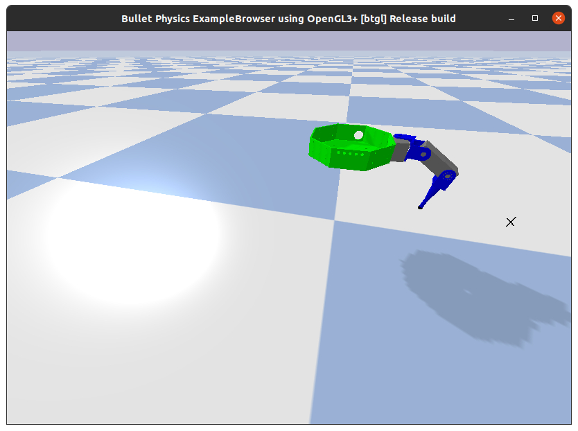

# Training one robot leg

This section gives some example and draws some conclusions about
the training of a single robot leg.

The environment resets the leg to a random position.
The agent has to command each servomotors
to move the endcap to a random objective (visualized by the cross).

```Python
# Reset all joint using normal distribution
for j in self.joint_list:
    p.resetJointState(self.robot_id, j,
                      np.random.uniform(low=-np.pi/4, high=np.pi/4))

# Set random target in a 3D box
self.target_position = np.array([
    np.random.uniform(0.219 - 0.069*self.delta, 0.219 + 0.069*self.delta),
    np.random.uniform(0.020 - 0.153*self.delta, 0.020 + 0.153*self.delta),
    np.random.uniform(0.128 - 0.072*self.delta, 0.128 + 0.072*self.delta),
])
```

!!! Warning "Batch size"

    As the target changes at each episode start,
    the batch size need to be large enough
    to make sure it contains some variance.



!!! Note

    Some early tests were done on StableBaselines3
    but as the library is currently being developed,
    the training was failing and the average episode reward was constant.

## First tests with a fixed objective

### With pytorch-a2c-ppo-acktr-gail

The defaults hyperparameters given in the
[pytorch-a2c-ppo-acktr-gail README](https://github.com/ikostrikov/pytorch-a2c-ppo-acktr-gail/blob/master/README.md)
are recommanded and are able to give good results for a first training.

!!! Warning

    The reward function is only using the distance to a **fixed** objective.
    This agent learned only to go to a fixed target.

The observation vector used here is:

| Num | Observation                                 |
| --- | ------------------------------------------- |
| 0   | position (first joint)                      |
| 1   | velocity (first joint)                      |
| 2   | torque (first joint)                        |
| 3   | position (second joint)                     |
| 4   | velocity (second joint)                     |
| 5   | torque (second joint)                       |
| 6   | position (third joint)                      |
| 7   | velocity (third joint)                      |
| 8   | torque (third joint)                        |
| 9   | the x-axis component of the endcap position |
| 10  | the y-axis component of the endcap position |
| 11  | the z-axis component of the endcap position |


**The training is successful and converges after 300k steps.**
The `enjoy.py` script shows the leg moving to the fixed target,
but it vibrates after reaching the objective.

### With StableBaselines

Start StableBaselines Docker as explained in [previous page](implementations_ppo.md).
Then in Jupyter web interface,

-   `check_env.ipynb` will check that OpenAI Gym environments are working as expected,
-   `one_leg_training.ipynb` is an example of PPO training on one leg,
-   `render.ipynb` will render the agent to a MP4 video or a GIF.

As planned, it works as well as `pytorch-a2c-ppo-acktr-gail` on PyTorch,
but this time we get much more tools such as
[TensorBoard](https://www.tensorflow.org/tensorboard) data and graph.

As StableBaselines stands out as being an easy PPO implementation
with a clear documentation and hyperparameters,
all the following training were done with it.

### Removing motors torque from observations

The observation vector used here is:

| Num | Observation                                 |
| --- | ------------------------------------------- |
| 0   | position (first joint)                      |
| 1   | velocity (first joint)                      |
| 2   | position (second joint)                     |
| 3   | velocity (second joint)                     |
| 4   | position (third joint)                      |
| 5   | velocity (third joint)                      |
| 6   | the x-axis component of the endcap position |
| 7   | the y-axis component of the endcap position |
| 8   | the z-axis component of the endcap position |

**WIP**

### Using cosinus and sinus of motor positions

This idea comes from [OpenAI Gym Reacher-v2 environment](https://github.com/openai/gym/wiki/Reacher-v2).

The observation vector used here is:

| Num | Observation                                 |
| --- | ------------------------------------------- |
| 0   | cos(position) (first joint)                 |
| 1   | sin(position) (first joint)                 |
| 2   | velocity (first joint)                      |
| 3   | cos(position) (second joint)                |
| 4   | sin(position) (second joint)                |
| 5   | velocity (second joint)                     |
| 6   | cos(position) (third joint)                 |
| 7   | sin(position) (third joint)                 |
| 8   | velocity (third joint)                      |
| 9   | the x-axis component of the endcap position |
| 10  | the y-axis component of the endcap position |
| 11  | the z-axis component of the endcap position |

**WIP**

## Learning to go to a random target

**WIP**
