**Table of content**:

[TOC]

* * *

This section gives examples of hyperparameters optimization.

Let's take `ReacherBulletEnv-v0` [hyperparameters from rl-baselines-zoo](https://github.com/araffin/rl-baselines-zoo/blob/master/hyperparams/ppo2.yml#L229) as an initial base and adapt them:

```yaml
n_envs: 8 -> 32
n_timesteps: 1e6 -> 250e3
policy: 'MlpPolicy'
n_steps: 2048 -> 128  # one episode ends at 32 steps, simulate 4 episodes per environment
nminibatches: 32 -> auto
lam: 0.95
gamma: 0.99 -> 0.90
noptepochs: 10 -> 30
ent_coef: 0.0 -> 0.01
learning_rate: 2.5e-4 -> 10e-4
cliprange: 0.2
```

# Observation vector comparison

When building the OpenAI Gym environment, many observations vectors are possible.
On the one hand removing data from observation that was required for learning will plumbed learning sample efficiency,
on the other hand adding useless observation will slow down the learning.

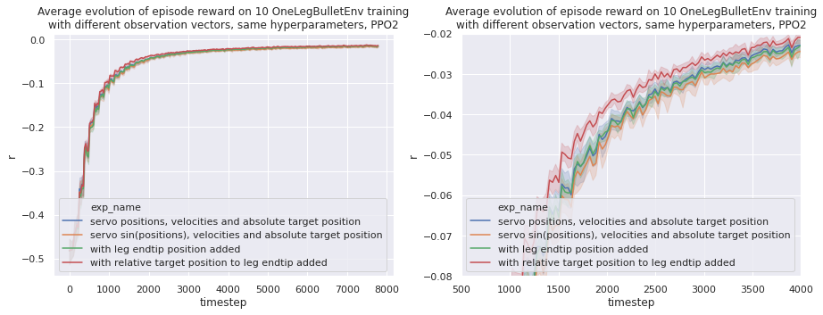

`ReacherBulletEnv-v0` uses cosinus and sinus for their angular observation.
In our case we only need the sinus of the servomotor position as the range go from $-\\pi/2$ to $\\pi/2$.
We observe that this does not help with learning (yellow plot).

One interesting observation is that we get quite the same learning performance with and without the absolute leg endtip position.
This means that we won't have to implement the direct mechanics of the leg when transferring this environment to reality.
**The agent learns the direct mechanics of the leg.**

**Overall tweaking the observation vector did not affect performance as much as optimizing hyperparameters.**
It is much more interesting to optimize learning hyperparameters rather than finding the perfect observation.

For all future training we will keep the following observation vector :
$$
obs = \\begin{pmatrix}
\\theta_1 \\ \\omega_1 \\ \\theta_2 \\ \\omega_2 \\ \\theta_3 \\ \\omega_3 \\ target_x \\ target_y \\ target_z \\end{pmatrix}
$$
$\\theta_i$ being the angle normalized between -1 (-90°) and 1 (90°) and $\\omega_i$ the velocity normalized.

# Optimizing the number of parallel environments

Each environment instantiate a PyBullet world with one leg.
If we instantiate only one environment (`n_envs=1`), data generation will be slow and won't use all computer resources.

We observed that on a i7-8750H (6 physical cores, 12 logical cores), `n_envs=12` did not use the most out of the processor.
Increasing the number of environment even higher helps gain some speed.

One environment uses CPU and RAM resources. One rule of thumb is to increase `n_envs` until we utilized all the memory.
`n_envs=32` requires approximately 12 GiB of RAM, and that is the sweet spot I used on my 16 GiB laptop.

# Tweaking the batch size

**The batch size represents the size of one batch of data that will be used for one learning epoch.**
Because learning is done on GPU and we are using small dimensions, increasing batch size should use more GPU resources and increase learning speed.

Also because the target and initial position of each simulation epoch is random, we need a large-enough batch size to have some variance.

Because we fixed `n_envs` in last step, the batch size can only be changed by tweaking the number of simulation episodes in each environment, or the number of minibatches.

$$
batch~size = \\frac{n_{steps} \\times n_{envs}}{n\_{minibatches}}
$$

## Tweaking the number of minibatches

With `nminibatches=1` we have no "mini batches", it is a **Batch Gradient Descent**.

Increasing `nminibatches` will cut the dataset generated by the simulations. This is **Mini Batch Gradient Descent**.
You can learn more about this on [this blog post](https://towardsdatascience.com/batch-mini-batch-stochastic-gradient-descent-7a62ecba642a).

Having `nminibatches` over 1 should decrease performances in our case because we are not learning over a huge dataset.

The following training was done with `n_envs=32` and `n_steps=128`. **So without mini batches we get the maximal batch size of 4096 simulation steps.**

<details>
   <summary>
    Show the code used for these learning.
   </summary>

```python
from gym_kraby.train import train

for batch_size in [32, 64, 128, 256, 512, 1024, 2048, 4096]:
    n_envs = 32  # opti
    n_steps = 128  # 4 simulation episodes per simulation

    if n_steps * n_envs < batch_size:
        nminibatches = 1  # limit batch_size to 32*128=4096
    else:
        nminibatches = int(n_steps * n_envs / batch_size)

    print("[+] Train hyperparam_batch_size_" + str(batch_size))
    train(
        exp_name="hyperparam_batch_size_" + str(batch_size),
        env_name="gym_kraby:OneLegBulletEnv-v0",
        n_envs=n_envs,
        gamma=0.90,  # Discount factor
        n_steps=n_steps,  # batchsize = n_steps * n_envs
        ent_coef=0.01,  # Entropy coefficient for the loss calculation
        learning_rate=10e-4,
        lam=0.95,  # Factor for trade-off of bias vs variance for Generalized Advantage Estimator
        nminibatches=nminibatches,  # Number of training minibatches per update.
        noptepochs=30,  # Number of epoch when optimizing the surrogate
        cliprange=0.2,  # Clipping parameter, this clipping depends on the reward scaling
    )
```

</details><br/>

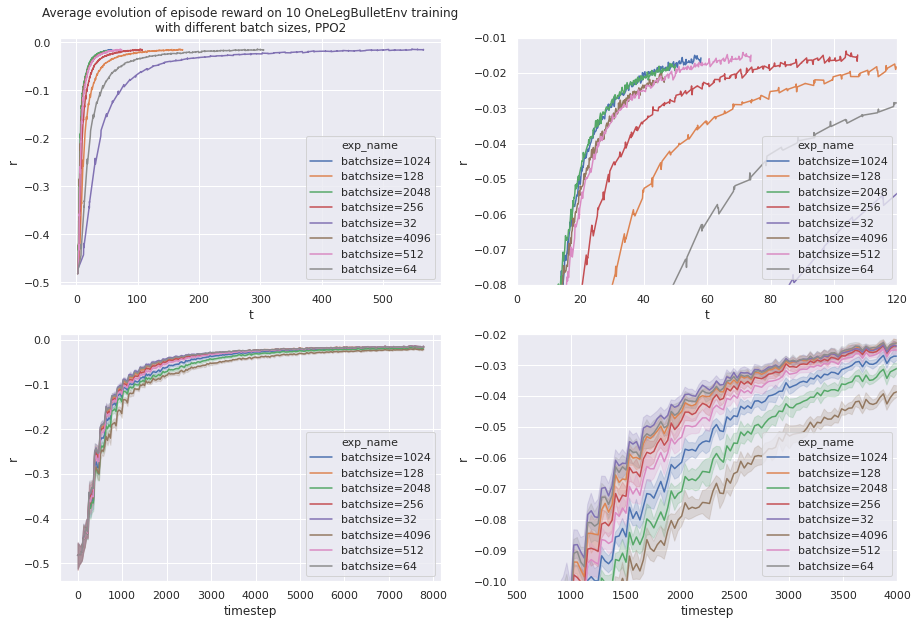

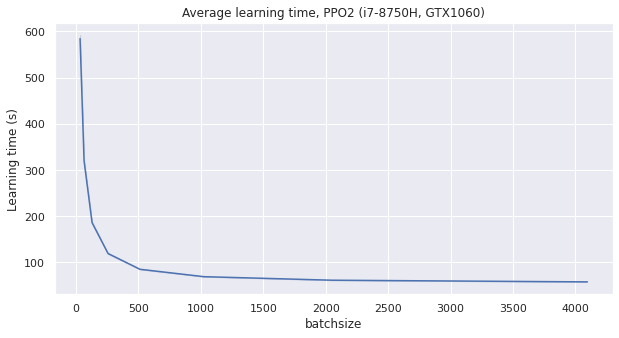

Lowering batch size using mini batches make small improvement of learning sample efficiency, but plumb the overall real world learning speed.

The conclusion of this experience is that we can keep `nminibatch=1` i.e. not splitting the generated data into smaller batch for the learning process. The batch size will be decided by the amount of environments multiplied by the number of simulated steps in each environments.

## Tweaking the number of simulation episodes

As a simulation episode contains 32 steps, so the number of steps `n_steps` generated by one environment correspond to $32 \\times n\_{episodes}$.

This experience change the amount of simulation episodes done in each environments (32 environments in our case). More simulation episodes will use more CPU time and create a larger batch of data.

<details>
   <summary>
    Show the code used for these learning.
   </summary>

```python
from gym_kraby.train import train

for n_steps in [32, 64, 128, 256, 512, 1024, 2048]:
    n_envs = 32  # opti
    nminibatches = 1  # opti

    print("[+] Train hyperparam_n_steps_" + str(n_steps))
    train(
        exp_name="hyperparam_n_steps_" + str(n_steps),
        env_name="gym_kraby:OneLegBulletEnv-v0",
        n_envs=n_envs,
        gamma=0.90,  # Discount factor
        n_steps=n_steps,  # batchsize = n_steps * n_envs
        ent_coef=0.01,  # Entropy coefficient for the loss calculation
        learning_rate=10e-4,
        lam=0.95,  # Factor for trade-off of bias vs variance for Generalized Advantage Estimator
        nminibatches=nminibatches,  # Number of training minibatches per update.
        noptepochs=30,  # Number of epoch when optimizing the surrogate
        cliprange=0.2,  # Clipping parameter, this clipping depends on the reward scaling
    )
```

</details><br/>

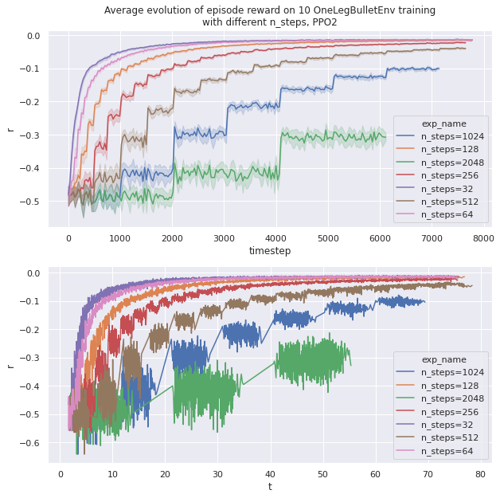

The more `n_steps` grows, the more GPU time is needed. A too large batch size deteriorates performances. In fact one episode on 32 simulations seems plenty enough to have enough variance in the dataset.

When `n_steps` is larger, the total learning time is a bit faster as the timestep limit is 250k and it does not divide well with high power of 2. It is also a bit faster because less data transfer occurs

# Tweaking number of optimization epoch

The number of optimization epoch (`noptepochs`) represents how many times we will use our generated data to optimize the neural network and reduce the surrogate.

A higher number of optimization epoch will use more GPU and may improve sample efficiency. If too many optimization epoch are done, the learning process will be slower.

<details>
   <summary>
    Show the code used for these learning.
   </summary>

```python
from gym_kraby.train import train

for noptepochs in [1, 5, 10, 20, 30, 50]:
    n_envs = 32  # opti
    n_steps = 128  # 4 simulation episodes per simulation
    nminibatches = 1  # opti

    print("[+] Train hyperparam_noptepochs_" + str(noptepochs))
    train(
        exp_name="hyperparam_noptepochs_" + str(noptepochs),
        env_name="gym_kraby:OneLegBulletEnv-v0",
        n_envs=n_envs,
        gamma=0.90,  # Discount factor
        n_steps=n_steps,  # batchsize = n_steps * n_envs
        ent_coef=0.01,  # Entropy coefficient for the loss calculation
        learning_rate=10e-4,
        lam=0.95,  # Factor for trade-off of bias vs variance for Generalized Advantage Estimator
        nminibatches=nminibatches,  # Number of training minibatches per update.
        noptepochs=noptepochs,  # Number of epoch when optimizing the surrogate
        cliprange=0.2,  # Clipping parameter, this clipping depends on the reward scaling
    )
```

</details><br/>

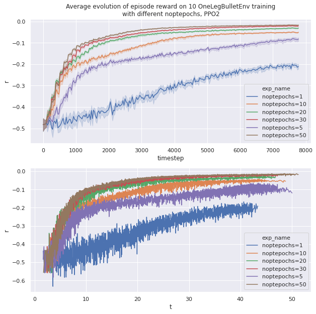

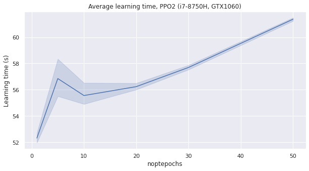

We observe as intended that increasing `noptepochs` makes the learning more sample efficient, but slower.
A good compromise seems to be `noptepochs=30`.

# Tweaking the discount factor

**The discount factor (`gamma`, $\\gamma$) is the coefficient used when summing all step rewards to get the episode return.**

$$
return = \\sum_n \\gamma^n~reward_n
$$

$\\gamma=1$ means that the learning does not differentiate between achieving good reward early or lately in the simulation episode.
We often see a value of $\\gamma$ between 0.9 and 0.999 in literature to promote getting good rewards early.

<details>
   <summary>
    Show the code used for these learning.
   </summary>

```python
from gym_kraby.train import train

for gamma in [0.2, 0.4, 0.6, 0.8, 0.9, 0.95, 0.98, 0.9999]:
    n_envs = 32  # opti
    nminibatches = 1  # opti
    noptepochs = 30  # opti
    n_steps = 32  # opti

    print("[+] Train hyperparam_gamma_" + str(gamma))
    train(
        exp_name="hyperparam_gamma_" + str(gamma),
        env_name="gym_kraby:OneLegBulletEnv-v0",
        n_envs=n_envs,
        gamma=gamma,  # Discount factor
        n_steps=n_steps,  # batchsize = n_steps * n_envs
        ent_coef=0.01,  # Entropy coefficient for the loss calculation
        learning_rate=10e-4,
        lam=0.95,  # Factor for trade-off of bias vs variance for Generalized Advantage Estimator
        nminibatches=nminibatches,  # Number of training minibatches per update.
        noptepochs=noptepochs,  # Number of epoch when optimizing the surrogate
        cliprange=0.2,  # Clipping parameter, this clipping depends on the reward scaling
    )
```

</details><br/>

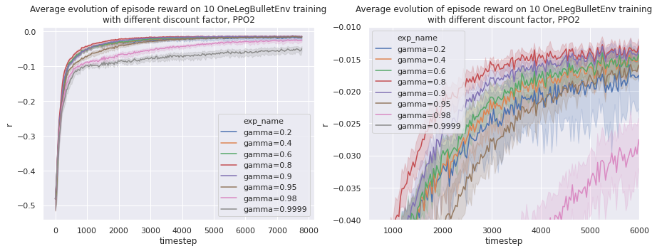

We observe that a discount factor between 0.8 and 0.9 gives best results. If the discount is too low or too high, then the repeatability of the learning decreases.

!!! warning

    We use the distance between the target and the robot leg end as reward at every step. This leads to a negative return to maximize. Much better performances might be achievable using the derivative.

# Tweaking the clip range

The PPO algorithm avoid too large policy update by clipping it. It uses a ratio that tell the difference between new and old policy and clip this ratio.
With a clip range of $\\varepsilon=0.2$, the ratio will be clipped from $1-\\varepsilon = 0.8$ to $1+\\varepsilon = 1.2$.

<details>
   <summary>
    Show the code used for these learning.
   </summary>

```python
from gym_kraby.train import train

for cliprange in [0.1, 0.2, 0.3, 0.4]:
    n_envs = 32  # opti
    nminibatches = 1  # opti
    noptepochs = 30  # opti
    n_steps = 32  # opti
    gamma = 0.8  # opti

    print("[+] Train hyperparam_cliprange_" + str(cliprange))
    train(
        exp_name="hyperparam_cliprange_" + str(cliprange),
        env_name="gym_kraby:OneLegBulletEnv-v0",
        n_envs=n_envs,
        gamma=gamma,  # Discount factor
        n_steps=n_steps,  # batchsize = n_steps * n_envs
        ent_coef=0.01,  # Entropy coefficient for the loss calculation
        learning_rate=10e-4,
        lam=0.95,  # Factor for trade-off of bias vs variance for Generalized Advantage Estimator
        nminibatches=nminibatches,  # Number of training minibatches per update.
        noptepochs=noptepochs,  # Number of epoch when optimizing the surrogate
        cliprange=cliprange,  # Clipping parameter, this clipping depends on the reward scaling
    )
```

</details><br/>

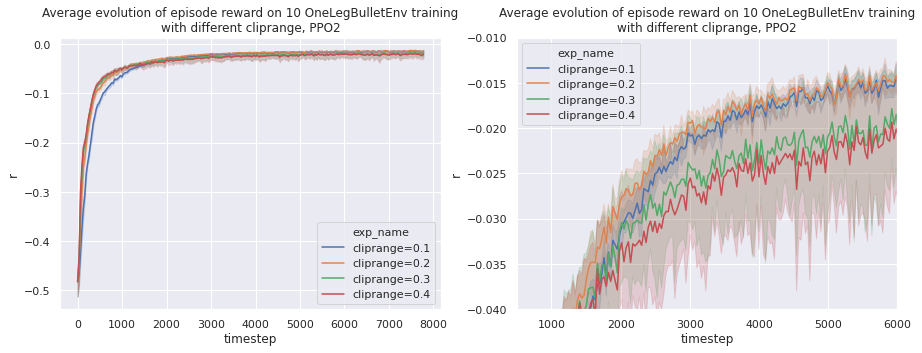

It seams that a clip range of 0.1 clips the update too much and degrade learning performance.
On the contrary, a clip range over 0.2 makes the policy updates too far and also degrade performance and repeatability.

# Tweaking the learning rate

The learning rate is another important hyperparameter. **It represents the size of learning steps done by the Adam optimizer.**
A bigger learning rate will increase learning speed but the learning might not converge as well as with a smaller rate.

<details>
   <summary>
    Show the code used for these learning.
   </summary>

```python
from gym_kraby.train import train

for learning_rate in [1e-4, 1e-3, 1e-2, 1e-1, 1]:
    n_envs = 32  # opti
    nminibatches = 1  # opti
    noptepochs = 30  # opti
    n_steps = 32  # opti
    gamma = 0.8  # opti
    cliprange = 0.2  # opti

    print("[+] Train hyperparam_learning_rate_" + str(learning_rate))
    train(
        exp_name="hyperparam_learning_rate_" + str(learning_rate),
        env_name="gym_kraby:OneLegBulletEnv-v0",
        n_envs=n_envs,
        gamma=gamma,  # Discount factor
        n_steps=n_steps,  # batchsize = n_steps * n_envs
        ent_coef=0.01,  # Entropy coefficient for the loss calculation
        learning_rate=learning_rate,
        lam=0.95,  # Factor for trade-off of bias vs variance for Generalized Advantage Estimator
        nminibatches=nminibatches,  # Number of training minibatches per update.
        noptepochs=noptepochs,  # Number of epoch when optimizing the surrogate
        cliprange=cliprange,  # Clipping parameter, this clipping depends on the reward scaling
    )
```

</details><br/>

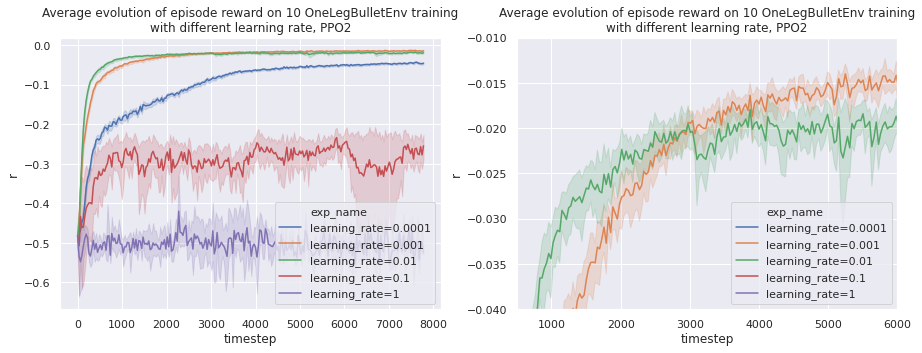

A learning rate of 0.01 gives the best sample efficiency. A smaller rate makes the learning converge closer to an optimal policy. One way to address this would be to lower the learning rate during the training.

# Tweaking the GAE smoothing factor

**The `lam` hyperparameter represents the smoothing factor $\\lambda$ in the Generalized Advantage Estimation.**
The Generalized Advantage Estimation is a method to estimate the advantage used by PPO.

<details>
   <summary>
    Show the code used for these learning.
   </summary>

```python
from gym_kraby.train import train

for lam in [0.8, 0.9, 0.92, 0.95, 0.98, 0.99, 1.0]:
    n_envs = 32  # opti
    nminibatches = 1  # opti
    noptepochs = 30  # opti
    n_steps = 32  # opti
    gamma = 0.8  # opti
    cliprange = 0.2  # opti
    learning_rate = 0.01  # opti

    print("[+] Train hyperparam_lam_" + str(lam))
    train(
        exp_name="hyperparam_lam_" + str(lam),
        env_name="gym_kraby:OneLegBulletEnv-v0",
        n_envs=n_envs,
        gamma=gamma,  # Discount factor
        n_steps=n_steps,  # batchsize = n_steps * n_envs
        ent_coef=0.01,  # Entropy coefficient for the loss calculation
        learning_rate=learning_rate,
        lam=lam,  # Factor for trade-off of bias vs variance for Generalized Advantage Estimator
        nminibatches=nminibatches,  # Number of training minibatches per update.
        noptepochs=noptepochs,  # Number of epoch when optimizing the surrogate
        cliprange=cliprange,  # Clipping parameter, this clipping depends on the reward scaling
    )
```

</details><br/>

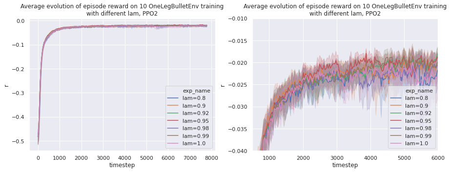

On our environment, this factor does not influence much. Even going far from common values seen in literature (0.9 to 1.0) yields similar performances.

# Tweaking the entropy coefficient

`ent_coef` is the entropy coefficient for the loss calculation. 

When optimizing the neural network, one summed term of the loss function represents the entropy of the exploration.
Raising this coefficient of ponderation will make the learning explore a bit more.

<details>
   <summary>
    Show the code used for these learning.
   </summary>

```python
from gym_kraby.train import train

for ent_coef in [0.00000001, 0.000001, 0.0001, 0.01, 0.1]:
    n_envs = 32  # opti
    nminibatches = 1  # opti
    noptepochs = 30  # opti
    n_steps = 32  # opti
    gamma = 0.8  # opti
    cliprange = 0.2  # opti
    learning_rate = 0.01  # opti
    lam = 0.95  # opti

    print("[+] Train hyperparam_ent_coef_" + str(ent_coef))
    train(
        exp_name="hyperparam_ent_coef_" + str(ent_coef),
        env_name="gym_kraby:OneLegBulletEnv-v0",
        n_envs=n_envs,
        gamma=gamma,  # Discount factor
        n_steps=n_steps,  # batchsize = n_steps * n_envs
        ent_coef=ent_coef,  # Entropy coefficient for the loss calculation
        learning_rate=learning_rate,
        lam=lam,  # Factor for trade-off of bias vs variance for Generalized Advantage Estimator
        nminibatches=nminibatches,  # Number of training minibatches per update.
        noptepochs=noptepochs,  # Number of epoch when optimizing the surrogate
        cliprange=cliprange,  # Clipping parameter, this clipping depends on the reward scaling
    )
```

</details><br/>

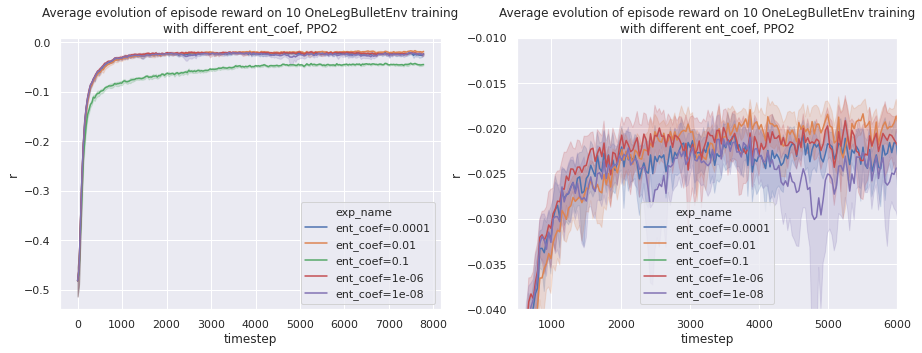

We observe that a `ent_coef=0.01` gives good results. Going higher makes the learning slower as we are exploring too much.
