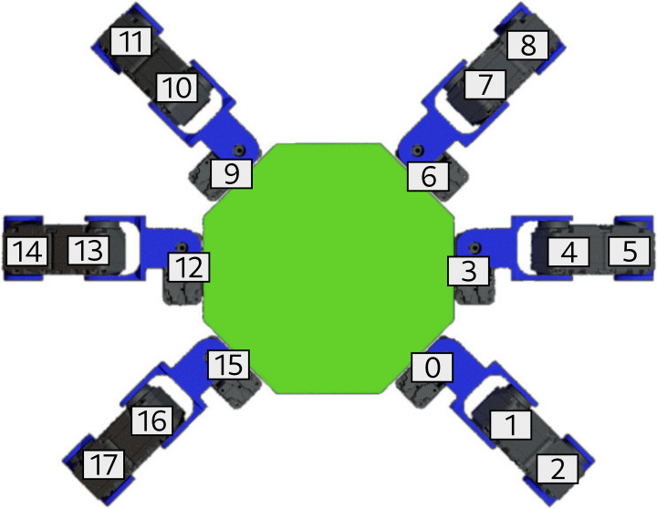

# Send and receive data from servomotors

The NanoPi NEO4 has five 3.3V UART that can go up to 1.5 Mbauds/s.
Two of these UART are used by the gigabit Ethernet controler
and one is used by the Bluetooth[^nanopi_wiki].

The [printed circuit boards](build_the_electronics.md) connect all
Herkulex DRS-0101 on NanoPi serial port `/dev/ttyS4` (UART4, 40-pin, GPIO1).
The debug UART (UART2, 8-pin, GPIO3) is unused.

## Initial set-up

To make everything go smoothly, you need to set each servomotors identifier
and make sure they are communicating at 500 000 bauds/s.
This can be done manually by connecting one servomotor at a time.
You may want to use a software like
[Herkulex Manager](http://hovis.co.kr/guide/herkulex_manager_eng.html)
to ease this process.

This indexing is the same in the URDF
and offers an easier way
to transfer a simulated control agent to the real robot.



!!! warning "Max baud-rate"

    Herkulex DRS-0101 are able to communicate in series as fast as 0.667 Mbauds/s.
    Nevertheless **RK3399 boards are unable to communicate at that baud-rate
    as their base baud-rate is 1.5 Mbaud/s[^rk3399dtsi]**.
    So 0.5 Mbaud/s is a good compromise (divided by 3 rather than 2.25).

## Server-side

To ease development, `ser2net` can be used to publish
this serial port to a TCP socket.
Then, this TCP socket can be used one the same network, on a computer connected to the robot or locally.

```bash
sudo apt install ser2net
sudo systemctl enable ser2net
```

Then edit `/etc/ser2net.conf` and replace the last lines with

```ini
2000:raw:600:/dev/ttyS4:500000 8DATABITS NONE 1STOPBIT
```

This will publish `/dev/ttyS4` with a baud-rate of 500 000 baud/s,
and some common serial configuration to `0.0.0.0:2000`.

Now, you may restart the service with `sudo systemctl restart ser2net`.

!!! note

    If you improperly disconnect the socket too many times,
    then you may need to restart `ser2net` service to clean up dead sockets.

It is also possible to use `socat` or `netcat` to achieve the same result,
but you may have to write a Systemd service unit and make sure that the
connection persist after ending an instance.

## Client-side

A client implementation is available at
<https://github.com/erdnaxe/kraby/blob/master/gym_kraby/utils/herkulex_socket.py>.

This client is able to control the robot and get positions,
velocities and speeds from all servomotors.

You can send a demo choreography to `10.42.0.1:2000` with:

```bash
python -m gym_kraby.utils.herkulex_socket
```

The robot will reset to its neutral position, then will receive two velocity commands.
In a perfect world without gravity, the robot should go back to its initial state.

<video style="max-width:100%;height:auto" preload="metadata" controls="">
<source src="https://perso.crans.org/erdnaxe/videos/projet_hexapod/demo_motors.mp4" type="video/mp4">
</video><br/>

### How slow is it?

The biggest bottleneck in this implementation is the data collecting.
All servomotors need to be manually pulled one at a time to get all positions,
velocities and torques.
This takes approximatively:

-   between 100 and 140 ms at 115 200 bauds/s with a TCP connection over WiFi
-   between 60 and 100 ms at 500 000 bauds/s with a TCP connection over WiFi
-   between 35 and 50 ms at 500 000 bauds/s locally

For the command it is much faster as it can be done using only one
`S_JOG` packet[^herkulex_manual].

[^nanopi_wiki]: "[NanoPi NEO4.](http://wiki.friendlyarm.com/wiki/index.php/NanoPi_NEO4)" FriendlyARM Wiki. October 2019.

[^herkulex_manual]: "[Herkulex DRS-0101/DRS-0201 User Manual.](https://www.robotshop.com/media/files/PDF/manual-drs-0101.pdf)" Version 1.00, March 2011.

[^rk3399dtsi]: "[RK3368 device-tree](https://github.com/torvalds/linux/blob/master/arch/arm64/boot/dts/rockchip/rk3368.dtsi#L388-L398)", lines 388-398. Linux Kernel source code. April 2020.
